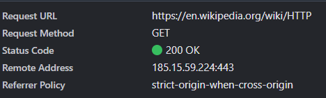
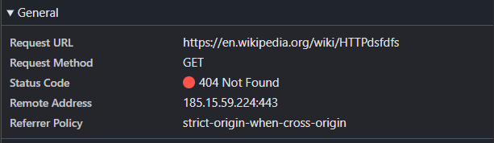
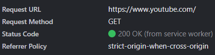
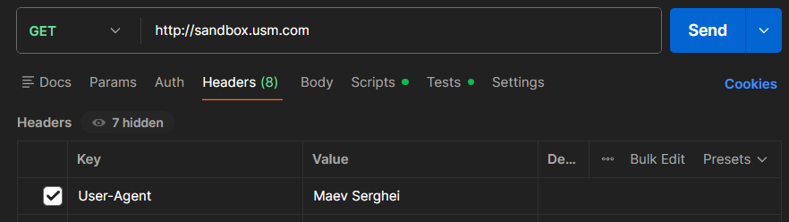

# Лабораторная работа №1. HTTP  
**Дисциплина:** PHP  
**Выполнил студент:** Maev Serghei  
**Группа:** I2402  

**Тема:** Анализ HTTP-запросов с использованием инструментов разработчика браузера и составление собственных HTTP-запросов.

---

## Цель работы

- Понять, что происходит, когда пользователь открывает сайт.  
- Научиться находить и анализировать HTTP-запросы в браузере.  
- Разобраться в назначении методов GET, POST, PUT, DELETE.  

---

## Задание 1. Анализ HTTP-запросов (Часть 1)

### Открытие страницы Wikipedia
Ссылка: https://en.wikipedia.org/wiki/HTTP  

В инструментах разработчика браузера (вкладка **Network**) был найден первый HTTP-запрос.



### Анализ запроса

**URL запроса:**  
https://en.wikipedia.org/wiki/HTTP  

**Метод запроса:**  
GET — используется для получения данных с сервера без изменения информации.

**Статус ответа:**  
200 OK — запрос успешно выполнен, страница загружена.  
(Также возможен 304 Not Modified при использовании кэша.)

**Заголовки запроса:**  
- `Request Method: GET` — метод запроса  
- `Remote Address: 185.15.59.224:443` — IP-адрес сервера  
- `Referrer Policy: strict-origin-when-cross-origin` — политика передачи заголовка Referer

**Заголовки ответа:**
- Content-Type — тип данных (text/html)  
- Content-Length — размер ответа  
- Date — дата ответа  
- Server — информация о сервере  

**Тело запроса:**  
Отсутствует (GET не передает тело).

**Тело ответа:**  
HTML-код страницы Wikipedia.

**Дополнительные запросы при загрузке страницы:**
- CSS — стили  
- JavaScript — логика интерфейса  
- изображения  
- шрифты  

Они необходимы для корректного отображения страницы.

---

### Переход по адресу  
https://en.wikipedia.org/wiki/HTTPdsfdfs  



**Статус ответа:**  
404 Not Found — страница не найдена.

---

## Задание 2. Анализ HTTP-запросов (Часть 2)

Ссылка: https://en.wikipedia.org/w/index.php?search=browser&title=Special%3ASearch&profile=advanced&fulltext=1&ns0=1 
Поиск по слову: **browser**

### Анализ запроса поиска

**URL запроса:**  
https://en.wikipedia.org/w/index.php?search=browser&title=Special%3ASearch 


**Метод запроса:**  
GET — используется для получения результатов поиска.
Почему используется именно этот метод?

  - Метод GET предназначен для получения (запроса) данных с сервера без изменения его состояния.

  - Параметры поиска передаются прямо в URL, что позволяет пользователю сохранить результат поиска в закладках или поделиться ссылкой с другими.

   - Ответы на GET-запросы эффективно кэшируются браузерами и CDN

**Query Parameters:**
Параметры передаются в части URL после знака `?` и разделяются символом `&`. В данном запросе они означают следующее:

|**Параметр**|**Значение**|**Описание**|
|---|---|---|
|**`search`**|`browser`|Ключевое слово, которое ввел пользователь для поиска.|
|**`title`**|`Special:Search`|Указывает движку MediaWiki, что нужно вызвать служебную страницу поиска.|
|**`profile`**|`advanced`|Определяет используемый профиль настроек поиска (в данном случае — расширенный).|
|**`fulltext`**|`1`|Флаг, указывающий на выполнение полнотекстового поиска по содержимому статей, а не просто переход к статье с таким названием.|
|**`ns0`**|`1`|Указывает область поиска в пространстве имен (Namespace 0). `ns0` соответствует основным статьям Wikipedia.|
---

## Задание 3. Анализ HTTP-запросов (Часть 3)

Сайт: https://www.youtube.com  

 

**Метод запроса:**  
GET

Почему используется: Стандартный метод для запроса и получения основного HTML-документа страницы. 

**Статус ответа:**  

Status Code: 200 OK (from service worker).

- Что это значит: Ответ был получен не напрямую с сервера через сеть, а перехвачен Service Worker. Это механизм кэширования в браузере, который позволяет мгновенно загружать страницу, используя ранее сохраненные данные, что критически важно для производительности и работы в офлайн-режиме.

**Дополнительные запросы:**
- JS-файлы  
- изображения  
- API-запросы  
- шрифты  

YouTube активно использует динамическую подгрузку контента.

---

## Задание 4. Составление HTTP-запросов

### 1. GET-запрос

**Запрос:**

```
GET / HTTP/1.1
Host: sandbox.usm.com
User-Agent: Maev Serghei
```


**Что такое User-Agent?**  
User-Agent — это стандартный заголовок HTTP‑запроса, содержащий строку характеристик, которая позволяет серверу идентифицировать тип приложения, операционную систему, поставщика программного обеспечения или версию ПО пользователя.

**Для чего используется:**
- **Адаптация контента:** сервер может отдавать разную верстку для мобильных устройств и ПК.  
- **Статистика:** сбор данных о том, какими браузерами пользуется аудитория.  
- **Блокировка ботов:** ограничение доступа для автоматизированных скриптов или парсеров.  

---

### 2. POST-запрос (добавление данных)

**Запрос:**

```
POST /cars HTTP/1.1
Host: sandbox.usm.com
Content-Type: application/x-www-form-urlencoded

make=Toyota&model=Corolla&year=2020
```

## 3. Другие методы HTTP и их назначение

| Метод   | Назначение |
|---------|------------|
| DELETE  | Удаляет указанный ресурс |
| HEAD    | Аналогичен GET, но запрашивает только заголовки (без тела ответа). Используется для проверки доступности файла |
| OPTIONS | Используется для описания параметров соединения с ресурсом (какие методы разрешены) |
| PATCH   | Используется для частичного изменения ресурса |
| TRACE   | Выполняет вызов сообщения с петлёй обратной связи (для тестирования) |

---

## 4. PUT-запрос (обновление ресурса)

**Запрос:**

```
PUT /cars/1 HTTP/1.1
Host: sandbox.usm.com
User-Agent: Maev Serghei
Content-Type: application/json

{
"make": "Toyota",
"model": "Corolla",
"year": 2021
}
```
### Разница между PUT и PATCH

- **PUT:** заменяет весь целевой ресурс текущими данными запроса. Если одно из полей не отправлено, оно может быть затёрто или стать пустым на сервере.  
- **PATCH:** применяет частичные изменения к ресурсу. Передаются только те поля, которые нужно изменить (например, только `year`), без затрагивания остальных.

---

## 5. Вариант ответа сервера на POST-запрос

**Запрос (из задания):**

```
POST /cars HTTP/1.1
Host: sandbox.com
Content-Type: application/json
User-Agent: John Doe
model=Corolla&make=Toyota&year=2020
```
**Возможный ответ (201 Created):**
```
HTTP/1.1 201 Created
Date: Thu, 12 Feb 2026 10:00:00 GMT
Content-Type: application/json
Location: /cars/123

{
"status": "success",
"id": 123,
"message": "Car added successfully"
}
```
## 6. Анализ кодов состояния (HTTP Status Codes)

| Код | Ситуация для запроса `/cars` |
|-----|-------------------------------|
| 200 OK | Запрос успешно обработан (чаще используется для GET или если сервер не создаёт новый ресурс, а подтверждает действие) |
| 201 Created | Автомобиль успешно добавлен в базу данных, создан новый ID |
| 400 Bad Request | Ошибка в синтаксисе запроса (например, в поле `year` передана строка вместо числа) |
| 401 Unauthorized | Требуется авторизация (отсутствует токен или логин) |
| 403 Forbidden | Пользователь авторизован, но не имеет прав на выполнение действия |
| 404 Not Found | Эндпоинт `/cars` не существует или был переименован |
| 500 Internal Server Error | Сбой на сервере или ошибка базы данных при сохранении записи |


### Литература

 - http://github.com/MSU-Courses/advanced-web-development/blob/main/01_Web_Development_Introduction/readme.md

 - https://en.wikipedia.org/wiki/HTTP

 - https://en.wikipedia.org/wiki/HTTPS
 