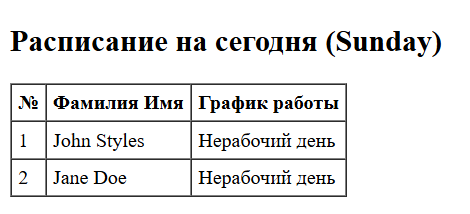
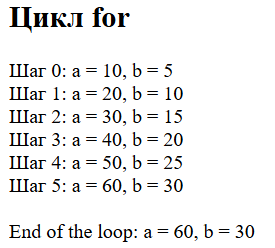
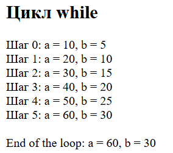
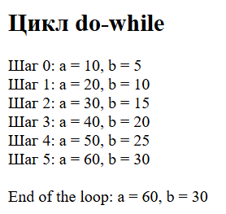

# Лабораторная работа №3. Управляющие конструкции

Студент: Maev Serghei

Группа: I2402

## Цель лабораторной работы

Цель лабораторной работы закрепить практические навыки работы с условными конструкциями в языке PHP.

## Ход работы

### Условные конструкции

Используя функцию date(), создал таблицу с расписанием, формируемым на основе текущего дня недели.

* Для John Styles (xx - xx):
    * Если текущий день недели — понедельник, среда или пятница, выведите график работы 8:00-12:00.
    * В остальные дни недели выведите текст: Нерабочий день.

* Для Jane Doe (yy - yy):
    * Если текущий день недели — вторник, четверг или суббота, выведите график работы 12:00-16:00.
    * В остальные дни недели выведите текст: Нерабочий день.

```php
<?php
// Получаем текущий день недели (1-7)
$day = date("N");

// John Styles
if ($day == 1 || $day == 3 || $day == 5) {
    $work = "8:00-12:00";
} else {
    $work = "Нерабочий день";
}

// Jane Doe
if ($day == 2 || $day == 4 || $day == 6) {
    $work = "12:00-16:00";
} else {
    $work = "Нерабочий день";
}
?>
```

> Результат:



### Циклы

1. Создал цикл через for c выводом промежуточных значений $a и $b на каждом шаге цикла.

    ```php
    echo "<h2>Цикл for</h2>";

    $a = 0;
    $b = 0;

    for ($i = 0; $i <= 5; $i++) {
        $a += 10;
        $b += 5;

        echo "Шаг $i: a = $a, b = $b <br>";
    }

    echo "<br>End of the loop: a = $a, b = $b";
    ```
    > Результат:

    

2. Переписал этот цикл, используя оператор while.

    ```php
    echo "<h2>Цикл while</h2>";
    $a = 0;
    $b = 0;
    $i = 0;

    while ($i <= 5) {
        $a += 10;
        $b += 5;

        echo "Шаг $i: a = $a, b = $b <br>";

        $i++;
    }

    echo "<br>End of the loop: a = $a, b = $b";
    ```
    > Результат:

    

3. Переписал цикл, используя оператор do-while.

    ```php
    echo "<h2>Цикл do-while</h2>";

    $a = 0;
    $b = 0;
    $i = 0;

    do {
        $a += 10;
        $b += 5;

        echo "Шаг $i: a = $a, b = $b <br>";

        $i++;

    } while ($i <= 5);

    echo "<br>End of the loop: a = $a, b = $b";
    ```

    > Результат:

    

## Контрольные вопросы

1. **В чем разница между циклами for, while и do-while? В каких случаях лучше использовать каждый из них?**

    Цикл for применяется тогда, когда заранее известно количество повторений. В нём в одной строке задаются инициализация счётчика, условие продолжения и его изменение. Это самый удобный вариант для счётных циклов и работы с индексами.

    Цикл while используется, когда количество повторений заранее неизвестно и зависит от выполнения некоторого условия. Проверка условия происходит перед каждой итерацией, поэтому цикл может не выполниться ни разу.

    Цикл do-while похож на while, но отличается тем, что сначала выполняет тело цикла, а затем проверяет условие. Поэтому он гарантированно выполняется минимум один раз.

    Кратко:

    * for — когда известно количество повторений;

    * while — когда повторение зависит от условия;

    * do-while — когда нужно выполнить код хотя бы один раз.


2. **Как работает тернарный оператор ? : в PHP?**

    Тернарный оператор — это сокращённая форма условной конструкции if-else, предназначенная для компактной записи простых логических проверок. Он позволяет выполнить проверку условия и сразу вернуть одно из двух значений в зависимости от результата.

    Общий принцип работы следующий: сначала вычисляется логическое выражение. Если оно истинно, возвращается значение, указанное после знака вопроса (?). Если выражение ложно, возвращается значение, указанное после двоеточия (:).

    По сути, тернарный оператор выполняет ту же функцию, что и стандартный if-else, но в более компактной форме. Чаще всего он используется для присваивания переменной значения в зависимости от условия или для краткого вывода результата.

    Применение тернарного оператора повышает лаконичность кода, однако при сложных логических конструкциях его использование может ухудшить читаемость. Поэтому он рекомендуется для простых проверок, а в более сложных случаях предпочтительнее использовать классическую условную конструкцию.

    > Синтаксис:

    ```php
    условие ? значение_если_true : значение_если_false;
    ```

3. Что произойдет, если в do-while поставить условие, которое изначально ложно?

    У нас выполниться тело цикла так проверка условия происходит после выполнения блока кода