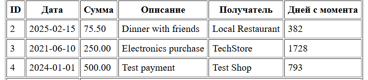
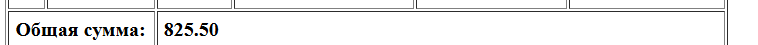

# Лабораторная работа №4. Массивы и Функции

Студент: Maev Serghei

Группа: I2402

## Цель лабораторной работы

Освоить работу с массивами в PHP, применяя различные операции: создание, добавление, удаление, сортировка и поиск. Закрепить навыки работы с функциями, включая передачу аргументов, возвращаемые значения и анонимные функции.

## Ход работы

### Задание 1. Работа с массивами

#### Задание 1.1. Подготовка среды

В начале файла включил строгую типизацию

```php
declare(strict_types=1);
```

#### Задание 1.2. Создание массива транзакций

В соотвествии с условиями создал массив транзакции:

* id – уникальный идентификатор транзакции;
* date – дата совершения транзакции (YYYY-MM-DD);
* amount – сумма транзакции;
* description – описание назначения платежа;
* merchant – название организации, получившей платеж.

```php
$transactions = [
    [
        "id" => 1,
        "date" => "2019-01-01",
        "amount" => 100.00,
        "description" => "pivo",
        "merchant" => "SuperMart",
    ],...
] 
```

#### Задание 1.3. Вывод списка транзакции

Использовал foreach, чтобы вывести список транзакций в HTML-таблице.

```php
    <?php foreach ($transactions as $transaction): ?>
        <tr>
            <td><?= htmlspecialchars((string)$transaction['id']) ?></td>
            <td><?= htmlspecialchars($transaction['date']) ?></td>
            <td><?= number_format($transaction['amount'], 2) ?></td>
            <td><?= htmlspecialchars($transaction['description']) ?></td>
            <td><?= htmlspecialchars($transaction['merchant']) ?></td>
            <td><?= daysSinceTransaction($transaction['date']) ?></td>
        </tr>
    <?php endforeach; ?>
```



#### Задание 1.4. Реализация функций

Создайте функцию calculateTotalAmount(array $transactions): float, которая вычисляет общую сумму всех транзакций и вывел сумму всех транзакций в конце таблицы

```php
function calculateTotalAmount(array $transactions): float {
    $total = 0.0;
    foreach ($transactions as $transaction) {
        $total += $transaction['amount'];
    }
    return $total;
}
```



