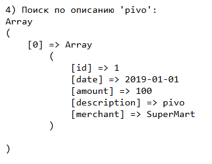
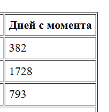
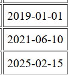
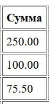

# Лабораторная работа №4. Массивы и Функции

Студент: Maev Serghei

Группа: I2402

## Цель лабораторной работы

Освоить работу с массивами в PHP, применяя различные операции: создание, добавление, удаление, сортировка и поиск. Закрепить навыки работы с функциями, включая передачу аргументов, возвращаемые значения и анонимные функции.

## Ход работы

### Задание 1. Работа с массивами

#### Задание 1.1. Подготовка среды

В начале файла включил строгую типизацию

```php
declare(strict_types=1);
```

#### Задание 1.2. Создание массива транзакций

В соотвествии с условиями создал массив транзакции:

* id – уникальный идентификатор транзакции;
* date – дата совершения транзакции (YYYY-MM-DD);
* amount – сумма транзакции;
* description – описание назначения платежа;
* merchant – название организации, получившей платеж.

```php
$transactions = [
    [
        "id" => 1,
        "date" => "2019-01-01",
        "amount" => 100.00,
        "description" => "pivo",
        "merchant" => "SuperMart",
    ],...
] 
```

#### Задание 1.3. Вывод списка транзакции

Использовал foreach, чтобы вывести список транзакций в HTML-таблице.

```php
    <?php foreach ($transactions as $transaction): ?>
        <tr>
            <td><?= htmlspecialchars((string)$transaction['id']) ?></td>
            <td><?= htmlspecialchars($transaction['date']) ?></td>
            <td><?= number_format($transaction['amount'], 2) ?></td>
            <td><?= htmlspecialchars($transaction['description']) ?></td>
            <td><?= htmlspecialchars($transaction['merchant']) ?></td>
            <td><?= daysSinceTransaction($transaction['date']) ?></td>
        </tr>
    <?php endforeach; ?>
```


#### Задание 1.4. Реализация функций

* **Создал функцию calculateTotalAmount(array $transactions): float, которая вычисляет общую сумму всех транзакций и вывел сумму всех транзакций в конце таблицы**

    ```php
    function calculateTotalAmount(array $transactions): float {
        $total = 0.0;
        foreach ($transactions as $transaction) {
            $total += $transaction['amount'];
        }
        return $total;
    }
    ```

    

* **Создал функцию findTransactionByDescription(string $descriptionPart), которая ищет транзакцию по части описания.**

    ```php
    function findTransactionByDescription(string $descriptionPart): array {
        global $transactions;

        $result = [];

        foreach ($transactions as $transaction) {
            if (stripos($transaction['description'], $descriptionPart) !== false) {
                $result[] = $transaction;
            }
        }

        return $result;
    }
    ```

    

* **Создал функцию findTransactionById(int $id), которая ищет транзакцию по идентификатору через array_filter**

    ```php
    function findTransactionByIdFilter(int $id): ?array {
        global $transactions;

        $filtered = array_filter(
            $transactions,
            fn(array $t): bool => $t['id'] === $id
        );

        return $filtered ? array_values($filtered)[0] : null;
    }
    ```
    Функция использует array_filter для фильтрации массива транзакций по условию совпадения ID. В качестве callback применяется стрелочная функция. Если фильтрация дала результат, возвращается первая найденная транзакция, иначе возвращается null.

* **Создал функцию daysSinceTransaction(string $date): int, которая возвращает количество дней между датой транзакции и текущим днем.**

    ```php
    function daysSinceTransaction(string $date): int {
    $transactionDate = new DateTime($date);
    $currentDate = new DateTime();

    $interval = $transactionDate->diff($currentDate);

    return (int)$interval->format('%a');
    }
    ```

    

* **Создал функцию addTransaction(int $id, string $date, float $amount, string $description, string $merchant): void для добавления новой транзакции.**

    ```php
    function addTransaction(
        int $id,
        string $date,
        float $amount,
        string $description,
        string $merchant
    ): void {
        global $transactions;

        $transactions[] = [
            "id" => $id,
            "date" => $date,
            "amount" => $amount,
            "description" => $description,
            "merchant" => $merchant,
        ];
    }
    ```

#### Задание 1.5. Сортировка транзакций

* **Отсортировать транзакции по дате с использованием usort()**

    ```php
    usort(
    $transactions,
    fn(array $a, array $b): int =>
        strtotime($a['date']) <=> strtotime($b['date'])
    );
    ```

    

* **Отсортируйте транзакции по сумме (по убыванию)**

    ```php
    usort(
    $transactions,
    fn(array $a, array $b): int =>
        $b['amount'] <=> $a['amount']
    );
    ```

    

### Задание 2. Работа с файловой системой

Для получения изображений использовалась функция scandir(). С помощью цикла for перебирались файлы директории, проверялось расширение .jpg, после чего изображения выводились через тег img.

```php
// Сканируем папку
$files = scandir($dir);

if ($files === false) {
    die('Ошибка чтения директории');
}

```

Для вывода изображений используется цикл for, который перебирает элементы массива $files.

```php
for ($i = 0; $i < count($files); $i++) {
```

Внутри цикла выполняется проверка, чтобы пропустить специальные элементы "." и "..", которые обозначают текущую и родительскую директории.

```php
if ($files[$i] != "." && $files[$i] != "..") {
```

Далее формируется полный путь к изображению:

```php
$path = $dir . $files[$i];
```

После этого определяется расширение файла:

```php
$ext = pathinfo($path, PATHINFO_EXTENSION);
```

Если расширение равно jpg, изображение выводится на страницу с помощью HTML-тега :

```php
echo '';
```

Таким образом, PHP динамически формирует HTML-код для отображения изображений.

### Контрольные вопросы

* **Что такое массивы в PHP?**

    Массивы это структура данных, которая позволяет хранить несколько значений в одной переменной. Элементы массива могут иметь числовые или строковые ключи и содержать разные типы данных

* **Каким образом можно создать массив в PHP?**

    Массив можно создать с помощью функции array() или с использованием короткого синтаксиса квадратных скобок []. В массив можно сразу добавить значения или добавить их позже.

* **Для чего используется цикл foreach?**

    Цикл foreach используется для перебора элементов массива. Он позволяет последовательно получать доступ к каждому элементу массива без необходимости работать с индексами.
