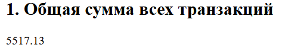
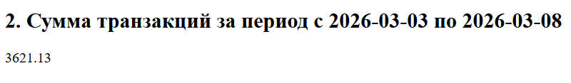
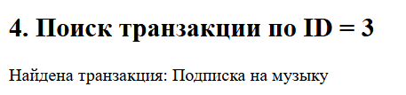
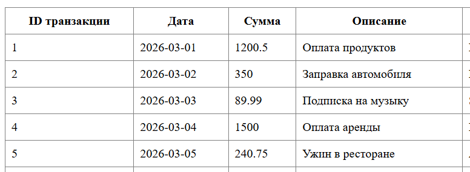
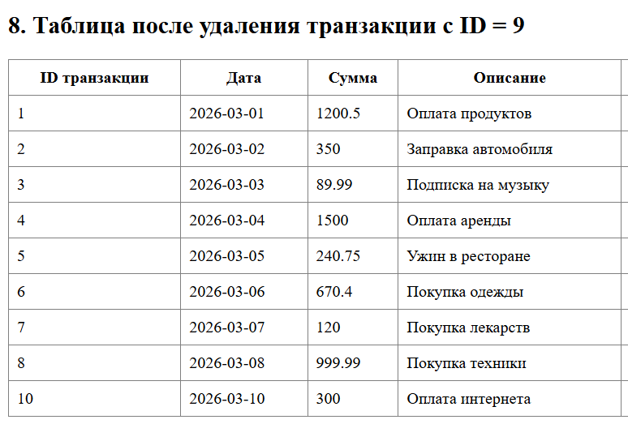

# Лабораторная работа №5. Объектно-ориентированное программирование в PHP

Студент: Maev Serghei

Группа: I2402

## Цель лабораторной работы

Освоить основы объектно-ориентированного программирования в PHP на практике. Научиться создавать собственные классы, использовать инкапсуляцию для защиты данных, разделять ответственность между классами, а также применять интерфейсы для построения гибкой архитектуры приложения.

## Условие

Необходимо разработать приложение для управления банковскими транзакциями, которое позволяет:

* хранить транзакции;

* добавлять новые транзакции;

* удалять транзакции;

* искать транзакции;

* сортировать транзакции;

* выполнять вычисления;

* выводить данные в виде HTML-таблицы.

## Инструкция по запуску
1. Убедитесь, что установлен PHP

    ```
    php -v
    ```
2. Перейдите в папку проекта

    ```
    cd путь/к/lab5
    ```
3. Запустите встроенный сервер PHP

    ```
    php -S localhost:8800
    ```
4. Откройте в браузере

    ```
    http://localhost:8800
    ```    
## Ход работы

### Структура проекта

Проект реализован в одном файле index.php и включает:

1. **Transaction**

    Модель одной транзакции. Содержит:
    * id
    * date
    * amount
    * description
    * merchant

    Методы:

    * getter-методы
    * getDaysSinceTransaction()

2. **TransactionStorageInterface**

    Интерфейс, определяющий методы работы с транзакциями:

    * addTransaction()
    * removeTransactionById()
    * getAllTransactions()
    * findById()

3. **TransactionRepository**

    Хранит массив транзакций и реализует интерфейс. Отвечает за:

    * добавление
    * удаление
    * поиск
    * получение всех данных

4. **TransactionManager**

    Реализует бизнес-логику:

    * вычисление общей суммы
    * фильтрация по датам
    * подсчёт транзакций
    * сортировка

5. **TransactionTableRenderer**

    Отвечает за отображение данных:

    * генерирует HTML-таблицу
    
### Примеры использования проекта

#### 1. Вычисление общей суммы всех транзакций

Данный пример показывает, как программа вычисляет сумму всех транзакций.

**Метод: `calculateTotalAmount()` (TransactionManager)**

```php
public function calculateTotalAmount(): float
{
    $total = 0.0;

    foreach ($this->repository->getAllTransactions() as $transaction) {
        $total += $transaction->getAmount();
    }

    return $total;
}
```

**Использование:**

```php
echo '<h2>1. Общая сумма всех транзакций</h2>';
echo '<p>' . $manager->calculateTotalAmount() . '</p>';
```


---

#### 2. Вычисление суммы транзакций за период

Позволяет получить сумму транзакций за указанный диапазон дат.

**Метод: `calculateTotalAmountByDateRange()` (TransactionManager)**

```php
public function calculateTotalAmountByDateRange(string $startDate, string $endDate): float
{
    $start = new DateTime($startDate);
    $end = new DateTime($endDate);
    $total = 0.0;

    foreach ($this->repository->getAllTransactions() as $transaction) {
        $transactionDate = $transaction->getDate();

        if ($transactionDate >= $start && $transactionDate <= $end) {
            $total += $transaction->getAmount();
        }
    }

    return $total;
}
```

**Использование:**

```php
echo '<h2>2. Сумма транзакций за период</h2>';
echo '<p>' . $manager->calculateTotalAmountByDateRange('2026-03-03', '2026-03-08') . '</p>';
```

---

#### 3. Поиск транзакции по ID

Позволяет найти конкретную транзакцию по идентификатору.

**Метод: `findById()` (TransactionRepository)**

```php
public function findById(int $id): ?Transaction
{
    foreach ($this->transactions as $transaction) {
        if ($transaction->getId() === $id) {
            return $transaction;
        }
    }

    return null;
}
```

**Использование:**

```php
$foundTransaction = $repository->findById(3);
echo $foundTransaction !== null
    ? 'Найдена транзакция: ' . $foundTransaction->getDescription()
    : 'Транзакция не найдена';
```

---

#### 4. Сортировка транзакций по дате

Сортирует транзакции по дате по возрастанию.

**Метод: `sortTransactionsByDate()` (TransactionManager)**

```php
public function sortTransactionsByDate(): array
{
    $transactions = $this->repository->getAllTransactions();

    usort($transactions, function (Transaction $a, Transaction $b): int {
        return $a->getDate() <=> $b->getDate();
    });

    return $transactions;
}
```

**Использование:**

```php
echo $renderer->render($manager->sortTransactionsByDate());
```

---

#### 5. Удаление транзакции по ID

Удаляет транзакцию и обновляет список.

**Метод: `removeTransactionById()` (TransactionRepository)**

```php
public function removeTransactionById(int $id): void
{
    foreach ($this->transactions as $index => $transaction) {
        if ($transaction->getId() === $id) {
            unset($this->transactions[$index]);
            break;
        }
    }

    $this->transactions = array_values($this->transactions);
}
```

**Использование:**

```php
$repository->removeTransactionById(9);
echo $renderer->render($repository->getAllTransactions());
```


---

## Контрольные вопросы

1. **Зачем нужна строгая типизация в PHP?**

Строгая типизация (declare(strict_types=1)) заставляет PHP строго проверять типы данных. Это предотвращает ошибки, повышает надёжность кода и упрощает его поддержку.

2. **Что такое класс в ООП?**

Класс — это шаблон для создания объектов. Основные компоненты:

* свойства (данные)
* методы (поведение)
* конструктор
* модификаторы доступа (public, private)

3. **Что такое полиморфизм?**

Полиморфизм — это способность использовать один интерфейс для разных реализаций. В PHP реализуется через:

* интерфейсы
* наследование

**Пример**: TransactionManager работает с TransactionStorageInterface, а не с конкретным классом.

4. **Что такое интерфейс и чем он отличается от абстрактного класса?**

Интерфейс в PHP — это специальная конструкция, которая определяет набор методов, которые должен реализовать класс. Интерфейс не содержит реализации методов, а только их объявления. Это означает, что любой класс, который реализует интерфейс, обязан реализовать все его методы.

Абстрактный класс, в отличие от интерфейса, может содержать как абстрактные методы (без реализации), так и обычные методы с уже реализованной логикой. Также абстрактный класс может иметь свойства и конструктор.

Основные отличия интерфейса от абстрактного класса:

* Интерфейс содержит только сигнатуры методов, без реализации.
* Абстрактный класс может содержать как реализацию, так и объявления методов.
* Класс может реализовать несколько интерфейсов, но наследовать только один абстрактный класс.
* Интерфейс задаёт «что должен делать класс», а абстрактный класс может частично определять «как он это делает».

Таким образом, интерфейсы используются для задания общего контракта поведения, а абстрактные классы — для частичной реализации и повторного использования кода.

5. **Какие преимущества дает использование интерфейсов при проектировании архитектуры приложения? Объясните на примере данной лабораторной работы.**

Использование интерфейсов позволяет сделать архитектуру приложения более гибкой, расширяемой и слабо связанной. Основное преимущество заключается в том, что классы начинают зависеть не от конкретной реализации, а от абстракции.

В данной лабораторной работе был создан интерфейс TransactionStorageInterface, который определяет методы для работы с транзакциями: добавление, удаление, поиск и получение всех транзакций. Класс TransactionRepository реализует этот интерфейс. Класс TransactionManager в свою очередь принимает в конструкторе не конкретный TransactionRepository, а интерфейс:

```php
public function __construct(
    private TransactionStorageInterface $repository
)
```
Это означает, что TransactionManager не зависит от конкретного способа хранения данных. В будущем можно заменить реализацию, не изменяя код самого менеджера. Например:

* хранить данные в базе данных;
* загружать из файла;
* получать через API.

Достаточно создать новый класс, который реализует тот же интерфейс. Таким образом, преимущества интерфейсов:

* уменьшение связанности между компонентами;
* возможность легко заменять реализацию;
* упрощение тестирования;
* повышение расширяемости системы.

В рамках данной лабораторной работы интерфейс позволил отделить бизнес-логику (TransactionManager) от способа хранения данных (TransactionRepository).

## Список использованных источников

* https://github.com/MSU-Courses/advanced-web-development/tree/main/05_OOP_PHP_Part_I

* https://www.php.net/manual/ru/index.php
