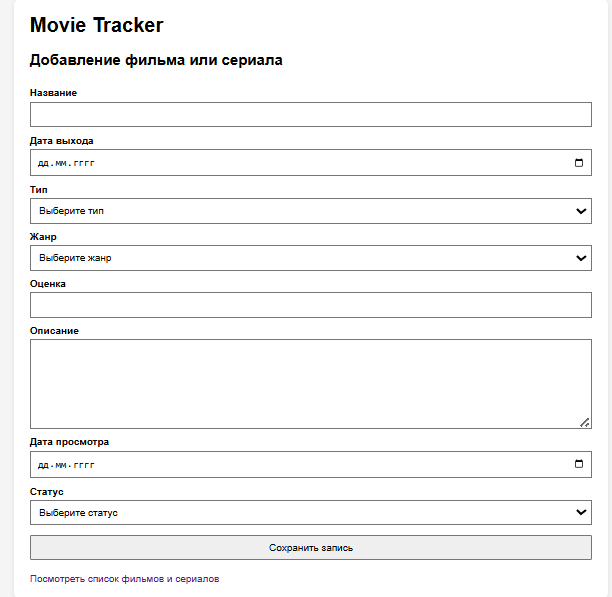
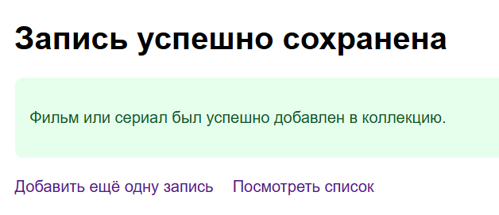
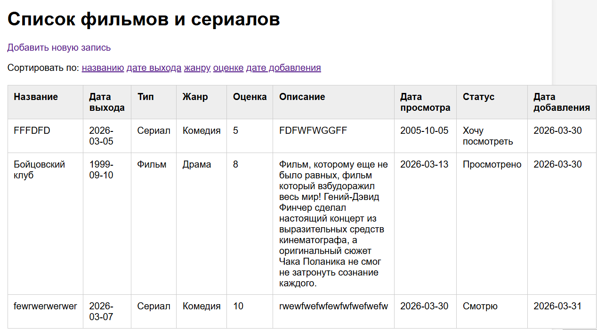
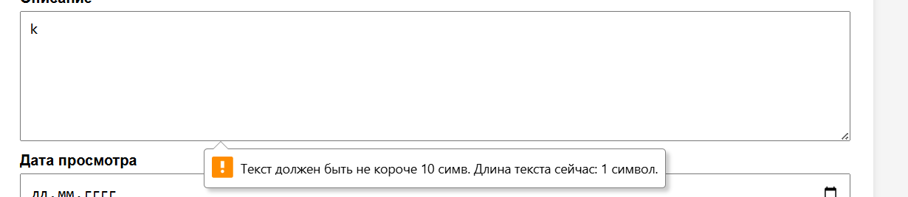

# Лабораторная работа №6. Обработка и валидация форм

## Цель работы

Освоить основные принципы работы с HTML-формами в PHP, включая отправку данных на сервер и их обработку, включая валидацию данных.

## Ход работы

### Шаг 1. Определение модели данных

Как проект я решил сделать Movie Tracker. Для него можно взять такую модель данных:

* title — название фильма или сериала. Тип: string
* release_date — дата выхода. Тип: date
* type — тип произведения. Тип: enum
    ```
    Возможные значения:
    Фильм,
    Сериал
    ```
* genre — жанр. Тип: enum
    ```
    Возможные значения:
    Боевик,
    Комедия и тд.
    ```
* rating — личная оценка. Тип: string или number
* description — описание / комментарий. Тип: text
* watched_at — дата просмотра. Тип: date
* status — статус просмотра. Тип: enum
    ```
    Возможные значения:
    Просмотрено,
    Смотрю,
    Планирую посмотреть
    ```
* created_at — дата добавления записи. Тип: date

### Шаг 2. Создание HTML-формы

На шаге 2 была разработана HTML-форма (index.php) для добавления новой записи (фильма или сериала).

**Форма**:
* использует метод POST для передачи данных на сервер;
* содержит все поля, соответствующие модели данных;
* включает клиентскую валидацию (HTML5);
* стилизована с помощью CSS для удобства использования.

#### Валидация на стороне клиента

Для улучшения пользовательского опыта реализована базовая HTML-валидация:

* required — обязательные поля;
* minlength, maxlength — ограничения длины текста;
* min, max — ограничения числовых значений.

Пример:
```html
<input type="text" name="title" required minlength="2" maxlength="100">

<input type="number" name="rating" min="1" max="10" required>

<textarea name="description" minlength="10" maxlength="1000" required></textarea>
```

#### Пример формы




### Шаг 3. Обработка данных на сервере

На данном этапе была реализована серверная логика обработки формы. После заполнения HTML-формы пользователь отправляет данные на сервер, где они проходят проверку и сохраняются в файл.

Для обработки данных используется файл save.php, который принимает данные формы, выполняет валидацию, формирует новую запись и сохраняет её в файл data/data.txt в формате JSON.

#### Что было реализовано на данном шаге

На шаге 3 был создан PHP-скрипт save.php, который выполняет следующие действия:

* принимает данные, отправленные методом POST;
* проверяет корректность HTTP-метода запроса;
* получает значения полей из массива $_POST;
* выполняет базовую валидацию данных;
* загружает уже существующие записи из файла;
* добавляет новую запись в массив данных;
* сохраняет обновлённый массив в файл;
* выводит сообщение об успешном сохранении или список ошибок.

#### Приём данных из формы

Для получения пользовательских данных используется суперглобальный массив $_POST.

Пример:
```php
$title = trim($_POST['title'] ?? '');
$releaseDate = trim($_POST['release_date'] ?? '');
$type = trim($_POST['type'] ?? '');
$genre = trim($_POST['genre'] ?? '');
$rating = trim($_POST['rating'] ?? '');
$description = trim($_POST['description'] ?? '');
$watchedAt = trim($_POST['watched_at'] ?? '');
$status = trim($_POST['status'] ?? '');
```

Функция trim() удаляет лишние пробелы в начале и в конце строки, а оператор ?? защищает от ошибки, если поле отсутствует.

Скрипт обрабатывает только POST-запросы.
Если файл открыть напрямую в браузере без отправки формы, будет выведено сообщение об ошибке.

Пример:
```php
if ($_SERVER['REQUEST_METHOD'] !== 'POST') {
    http_response_code(405);
    echo 'Ошибка: разрешён только метод POST.';
    exit;
}
```
#### Формирование новой записи
Для проверки введённых данных используется функция validateMovieData(), размещённая в файле **includes/functions.php**.

После успешной проверки создаётся новая запись, которая представляет собой ассоциативный массив.

Пример:
```php
$newMovie = [
    'title' => $title,
    'release_date' => $releaseDate,
    'type' => $type,
    'genre' => $genre,
    'rating' => (int)$rating,
    'description' => $description,
    'watched_at' => $watchedAt,
    'status' => $status,
    'created_at' => date('Y-m-d'),
];
```

#### Пример функции сохранения

В проекте используется функция saveData(), которая сериализует массив в JSON и записывает его в файл.

```php
function saveData(string $fileName, array $data): void
{
    $json = json_encode($data, JSON_PRETTY_PRINT | JSON_UNESCAPED_UNICODE);

    if ($json === false) {
        throw new RuntimeException("Не удалось сериализовать данные для сохранения в файл: $fileName");
    }

    if (file_put_contents($fileName, $json) === false) {
        throw new RuntimeException("Не удалось записать данные в файл: $fileName");
    }
}
```

Как записываются данные в файле

```json
[
    {
        "title": "Бойцовский клуб",
        "release_date": "1999-09-10",
        "type": "Фильм",
        "genre": "Драма",
        "rating": 8,
        "description": "Фильм, которому еще не было равных, фильм который взбудоражил весь мир! Гений-Дэвид Финчер сделал настоящий концерт из выразительных средств кинематографа, а оригинальный сюжет Чака Поланика не смог не затронуть сознание каждого.",
        "watched_at": "2026-03-13",
        "status": "Просмотрено",
        "created_at": "2026-03-30"
    },
]    
```

Также пример успешной записи файла




### Шаг 4. Вывод данных

Для загрузки данных используется функция loadData(), определённая в файле **includes/functions.php**. Она открывает файл с данными, считывает JSON и преобразует его в массив.

```php
function loadData(string $fileName): array
{
    if (!file_exists($fileName)) {
        return [];
    }

    if (!is_readable($fileName)) {
        throw new RuntimeException("Не удалось прочитать файл: $fileName");
    }

    $content = file_get_contents($fileName);

    if ($content === false) {
        throw new RuntimeException("Ошибка чтения файла: $fileName");
    }

    if (trim($content) === '') {
        return [];
    }

    $data = json_decode($content, true);

    if (!is_array($data)) {
        throw new RuntimeException("Некорректный JSON в файле: $fileName");
    }

    return $data;
}
```

#### Отображение данных в виде таблицы

После чтения данных каждая запись выводится в виде строки HTML-таблицы. Для отображения используются стандартные элементы HTML, а для отображения всех сохранённых фильмов используется цикл foreach.

Пример структуры таблицы:
```html
        <table>
            <thead>
            <tr>
                <th>Название</th>
                <th>Дата выхода</th>
                <th>Тип</th>
                <th>Жанр</th>
                <th>Оценка</th>
                <th>Описание</th>
                <th>Дата просмотра</th>
                <th>Статус</th>
                <th>Дата добавления</th>
            </tr>
            </thead>
            <tbody>
            <?php foreach ($movies as $movie): ?>
                <tr>
                    <td><?= e((string)($movie['title'] ?? '')) ?></td>
                    <td><?= e((string)($movie['release_date'] ?? '')) ?></td>
                    <td><?= e((string)($movie['type'] ?? '')) ?></td>
                    <td><?= e((string)($movie['genre'] ?? '')) ?></td>
                    <td><?= e((string)($movie['rating'] ?? '')) ?></td>
                    <td><?= e((string)($movie['description'] ?? '')) ?></td>
                    <td><?= e((string)($movie['watched_at'] ?? '')) ?></td>
                    <td><?= e((string)($movie['status'] ?? '')) ?></td>
                    <td><?= e((string)($movie['created_at'] ?? '')) ?></td>
                </tr>
            <?php endforeach; ?>
            </tbody>
        </table>
```

Для безопасного вывода текста используется функция e(), которая преобразует специальные HTML-символы и защищает страницу от некорректного отображения данных.

#### Сортировка данных

Для повышения удобства использования в проект была добавлена сортировка записей.
Параметр сортировки передаётся через строку запроса с помощью $_GET['sort'].

Пример получения параметра:
```php
$sort = $_GET['sort'] ?? '';
```
В зависимости от выбранного значения массив $movies сортируется с помощью функции usort().

Пример:
```php
switch ($sort) {
    case 'title':
        usort($movies, fn(array $a, array $b): int => strcmp($a['title'], $b['title']));
        break;

    case 'release_date':
        usort($movies, fn(array $a, array $b): int => strcmp($a['release_date'], $b['release_date']));
        break;

    case 'genre':
        usort($movies, fn(array $a, array $b): int => strcmp($a['genre'], $b['genre']));
        break;

    case 'rating':
        usort($movies, fn(array $a, array $b): int => $a['rating'] <=> $b['rating']);
        break;

    case 'created_at':
        usort($movies, fn(array $a, array $b): int => strcmp($a['created_at'], $b['created_at']));
        break;
}
```



### Шаг 5. Дополнительные функции

На этом этапе была переработана система проверки формы.
Были выполнены следующие действия:

* создан интерфейс ValidatorInterface;
* реализованы отдельные классы валидаторов;
* каждый валидатор стал отвечать только за одну конкретную проверку;
* функция validateMovieData() была изменена так, чтобы запускать набор валидаторов последовательно.

**Интерфейс валидатора**

Был создан интерфейс ValidatorInterface, который задаёт единый метод для всех проверок:
```php
interface ValidatorInterface
{
    public function validate(array $data): ?string;
}
```
Этот интерфейс определяет единый контракт: каждый валидатор принимает массив данных формы и возвращает либо сообщение об ошибке, либо null, если проверка прошла успешно.

**Реализованные валидаторы**

В проекте были реализованы следующие валидаторы:

* RequiredValidator — проверяет, что поле заполнено;
* LengthValidator — проверяет длину текстового поля;
* DateValidator — проверяет корректность даты;
* InArrayValidator — проверяет, входит ли значение в список допустимых;
* RatingValidator — проверяет, что оценка является числом в заданном диапазоне.

Такое разделение позволяет легко добавлять новые проверки без изменения уже существующих классов.

**Пример реализации валидатора**

Ниже приведён пример валидатора обязательного поля:
```php
class RequiredValidator implements ValidatorInterface
{
    private string $field;
    private string $label;

    public function __construct(string $field, string $label)
    {
        $this->field = $field;
        $this->label = $label;
    }

    public function validate(array $data): ?string
    {
        $value = trim((string)($data[$this->field] ?? ''));

        if ($value === '') {
            return "Поле \"{$this->label}\" обязательно для заполнения.";
        }

        return null;
    }
}
```



## Контрольные вопросы

### 1. Какие существуют методы отправки данных из формы на сервер? Какие методы поддерживает HTML-форма?

Существует несколько HTTP-методов передачи данных, однако HTML-форма поддерживает два основных метода:

* **GET**
* **POST**

**GET**:

* данные передаются через URL (в строке запроса);
* используется для получения данных;
* имеет ограничение по длине;
* менее безопасен (данные видны в адресной строке).

**POST**:

* данные передаются в теле запроса;
* используется для отправки и изменения данных;
* не имеет строгих ограничений по объёму;
* более безопасен, чем GET (данные не отображаются в URL).

### 2. Какие глобальные переменные используются для доступа к данным формы в PHP?

В PHP используются суперглобальные массивы:

* `$_GET` — для получения данных, отправленных методом GET;
* `$_POST` — для получения данных, отправленных методом POST;
* `$_REQUEST` — объединяет данные из GET, POST и COOKIE (используется реже).

Пример:

```php
$name = $_POST['name'];
```

### 3. Как обеспечить безопасность при обработке данных из формы (например, защититься от XSS)?

Для обеспечения безопасности необходимо:

1. **Экранирование вывода (защита от XSS)**
   Используется функция:

   ```php
   htmlspecialchars()
   ```

   Она преобразует специальные символы в безопасный HTML.

2. **Валидация данных**
   Проверка:

   * обязательных полей;
   * формата данных (дата, число и т.д.);
   * допустимых значений.

3. **Фильтрация данных**
   Например:

   ```php
   filter_var($email, FILTER_VALIDATE_EMAIL);
   ```

4. **Использование prepared statements (для БД)**
   Защищает от SQL-инъекций (в данном проекте не используется, так как данные хранятся в файле).
